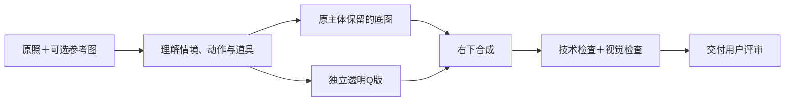

# cool-chibi-photo · 照片里的另一个你

保留真实照片，在右下角加一枚**同款人物或宠物Q版贴纸**。按需整理照片背景光色、比较竖版布局，并加入轻贴纸和随场景变化的手写短句。Q版应让人认出“是谁、穿什么、正在做什么”：工作照保留电脑与工作手，抱玩偶保留抱持关系，屈腿摆姿就把那条腿弯起来。

这是 [iluluskill · 会客厅 skill](https://github.com/ilulu66/iluluskill) 中可独立安装的照片创作工具。当前版本 **2.2.0**。

> **需要有读图和图像生成/编辑能力的 Agent。** Skill提供工作方法与本地脚本，不附带生图模型、API额度或自动抠图服务。安装成功不代表宿主具备生图能力。

## 30秒开始

只安装这一件：

```bash
npx -y skills add ilulu66/iluluskill -g --skill cool-chibi-photo
```

或者安装整个箱子：

```bash
npx -y skills add ilulu66/iluluskill -g --all
```

已有同名安装先定位并备份，避免不同目录的旧版同时生效。无需安装时，也可复制 [独立提示词](PROMPT-ALL-IN-ONE.txt)，但纯聊天环境未必能完成分层文件交付。手动安装和脚本环境见 [装载说明](references/CODEX_SETUP.md)。

上传照片，然后说：

```text
按 cool-chibi-photo 处理，背景A、构图B。
原照决定人物、衣服和整体动作；我给的参考图决定Q版画风与比例。
原主体不重绘，右下角贴纸要能看清动作。
未见下装和鞋子允许简洁设计补全，仅用于Q版。
```

想要带轻装饰的版本，可以继续说：

```text
背景也小优化一下；单人照可考虑4:5竖版。
加少量手绘小贴纸，文字根据这张照片自由选一句，不固定套参考口号。
Q版仍还原这张照片的整体动作。
```

没有参考图也能做。有喜欢的小人/效果图时一并上传，说明喜欢的是画风、比例还是布局。已经说过的设置会沿用。

## 你会拿到什么

```text
一次照片任务/
├── base.png      # 无贴纸底图
├── chibi.png     # 独立真透明Q版
├── final.png     # 合成成品
├── job.json      # 本次选项、实际提示词、参考图角色与变换
└── qa.json       # 技术检查、视觉检查、用户接受状态
```

修改另存版本。多张原图分别输出，原片保留。

## 背景和构图怎么选

两个字母分别选择，**AB = 背景保留＋构图轻优化**。

| 维度 | A | B | C |
|---|---|---|---|
| 背景 | 保留原场景，按需整理全局及局部光色 | 清理指定杂物/路人，轻虚化 | 更换为指定或授权推荐场景 |
| 构图 | 保留画幅与位置 | 有实际收益的轻裁切/校正 | 目标画幅、原场景延展或完整前景组重排 |

换景时保留人物与关键道具整组关系，背景匹配其透视、光线和支撑面。重新构图不自动意味着换景、加白边或补画真人缺失的身体。完整规则见 [背景与重新构图](references/BACKGROUND_COMPOSITION.md)。

**已实测**：单人照片、背景A、构图B、参考图引导的Q版、透明贴纸与本地合成。**尚未完成端到端实图验证**：背景B/C、构图C、多人和宠物流程。具体范围见 [验证报告](VALIDATION.md)。

## 为什么分层做



- **照片背景也要判断。** 保留原场景时，仍可整理局部光色和亮面，让人物更清楚；同尺寸看前后收益，避免一律套滤镜。
- **原照给内容，参考图给画法。** 不把参考图的眨眼、衣服或站姿顺手搬过来。
- **保留完整情境。** “电脑前工作、顺手比耶”包含工作手与电脑，不能只画一个比耶小人。
- **局部遮挡保留可见神态。** 手机挡住一部分脸时，仍应画出露出区域的眼睛/眉毛；按用户要求可在Q版中微调遮挡。完全遮住或明确要求不露脸时不强行补眼。
- **角色设计先定，再重摆动作。** 弯曲短腿完成坐姿，家具适配人物；不为露全身拉长身体。
- **两种保护区分开。** 换背景需要保留完整人物；叠贴纸只需避开脸、主要手势及关键道具，允许适度叠下方头发与衣服。
- **尺寸以可读为准。** 默认约30%画宽，先局部内移再缩小；默认下限22%，可按用户要求调整。
- **局部修改不牵连全图。** 改动作只修Q版，改大小只重合成，保留已接受的图层。

## 常见修改

| 你说 | 应该发生什么 |
|---|---|
| “小人动作更像原图” | 锁定画风/比例，修改整体姿势、视线、两只手和道具关系 |
| “用这个站着的小人的比例” | 取角色身体结构，按当前照片重摆动作 |
| “手机挡脸也得有眼睛” | 保留自拍动作，修正可见眼部；按用户要求仅在Q版层微调遮挡，不画穿透手机的眼睛 |
| “右下大一点” | 调整合成，仍避开脸、手势及关键互动区域 |
| “单人可以考虑竖版” | 比较原比例与4:5/3:4，优先裁切原片；保持人物、动作、核心道具完整 |
| “加点贴纸，文字随机” | 根据本图选短句与少量点缀，在留白排版；每张变化，不照抄参考口号或套无关故事 |
| “背景也小优化一下” | 先找1～3项实际干扰，克制整理局部明暗、偏色和抢眼色块；未授权删物时保留所有物体 |
| “清掉后面的路人” | 明确背景B的清理对象，保留主角和原场景 |
| “只加右侧白边” | 对已确认成品增加画布，原有效区不重绘、不重采样 |

## 工具与验证边界

| 部分 | 本包提供 | 需要当前环境 |
|---|---|---|
| 情境/参考/构图决策 | Skill及提示词模板 | Agent读图与判断 |
| Q版、换景资产 | 生成与修改约束 | 可用图像生成/编辑工具 |
| 调色、蒙版恢复、裁切/留白、合成 | Python脚本 | Python 3.10+、Pillow、NumPy |
| 人物抠图、发丝蒙版 | 流程与验收说明 | 编辑工具或实际制作的蒙版 |
| 动作/比例/审美验收 | 检查项 | Agent目视＋用户评价 |

内置生图优先，按宿主实际接口执行。其他 Agent 可复用此流程，但本项目不声称已验证所有平台；缺生图能力时应说明受阻步骤。

指定蒙版的像素相同，不能证明整张图的画风、动作或身份相似度正确。全局调色不是商业精修，生成模型仍可能画错手脚或衣物。没有通用“百分百保脸”保证，详细技术边界见 [执行流程](references/WORKFLOW.md)。

## 给维护者

```bash
cd skills/cool-chibi-photo
python3 -m venv .venv
source .venv/bin/activate
python -m pip install -r requirements.txt
python -m unittest discover -s tests -v
```

仓库内可运行 `python tools/check_cool_chibi_package.py` 检查分发清单、示例与内部链接。修改分发内容后用 `--write-manifest` 更新SHA-256清单，再校验。CI只做确定性检查，不自动调用生图或付费API。

- [整体复盘：改对了什么、还缺什么](references/RETROSPECTIVE.md)
- [生成与定向修改提示词](references/PROMPTS.md)
- [竖版候选、轻贴纸与短文案](references/DECORATION_LAYOUT.md)
- [默认设置](assets/settings.default.json) · [任务记录示例](assets/job.example.json)

## 授权与素材

沿用仓库现有分层授权：**软件代码 MIT；说明、提示词与方法论文档 CC BY-NC 4.0**。见 [LICENSE.md](LICENSE.md)。

公开包不附带私人原照、用户角色参考、任务记录或本机路径；自行提供有权使用的素材。本包授权不代替输入照片、参考图和生成服务各自适用的条款。
